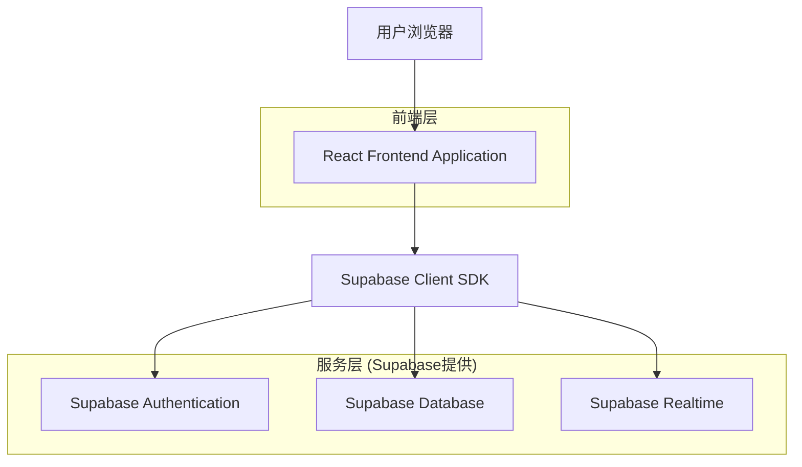
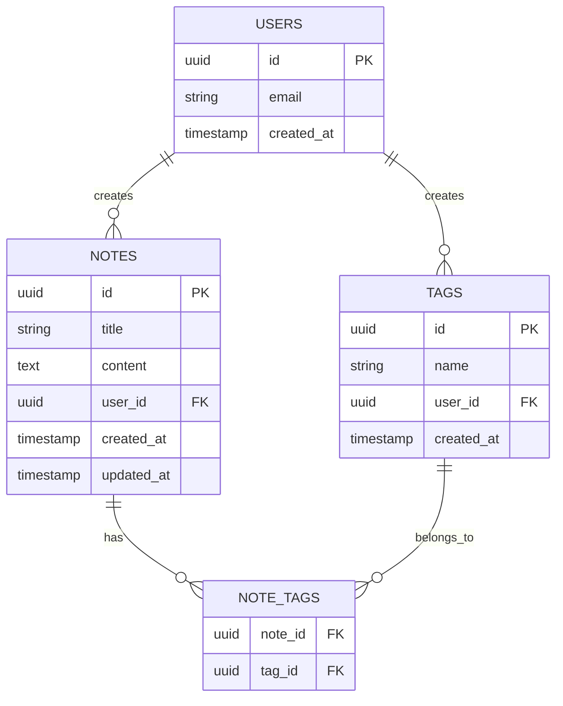

# 云笔记软件 - 技术架构文档

## 1. 架构设计



## 2. 技术描述
- **前端**: React@18 + TailwindCSS@3 + Vite
- **初始化工具**: vite-init
- **后端**: Supabase (Authentication + PostgreSQL + Realtime)
- **富文本编辑**: TipTap 或 Slate.js
- **状态管理**: React Context + useState/useReducer
- **路由**: React Router v6

## 3. 路由定义
| 路由 | 用途 |
|------|------|
| /login | 登录/注册页，用户身份验证入口 |
| /notes | 笔记列表页，展示所有笔记，支持搜索筛选 |
| /notes/new | 新建笔记页，创建新笔记 |
| /notes/:id | 笔记编辑页，查看和编辑特定笔记 |
| /tags | 标签管理页，管理笔记标签 |
| / | 重定向到 /notes |

## 4. API 定义

### 4.1 Supabase 核心 API

**用户认证**
```typescript
// 注册
supabase.auth.signUp({
  email: string,
  password: string
})

// 登录
supabase.auth.signInWithPassword({
  email: string,
  password: string
})

// 登出
supabase.auth.signOut()

// 获取当前用户
supabase.auth.getUser()
```

**笔记操作**
```typescript
// 获取用户所有笔记
supabase
  .from('notes')
  .select('*, tags(*)')
  .eq('user_id', userId)
  .order('updated_at', { ascending: false })

// 创建笔记
supabase
  .from('notes')
  .insert({
    title: string,
    content: string,
    user_id: string
  })

// 更新笔记
supabase
  .from('notes')
  .update({
    title: string,
    content: string,
    updated_at: new Date()
  })
  .eq('id', noteId)

// 删除笔记
supabase
  .from('notes')
  .delete()
  .eq('id', noteId)
```

**标签操作**
```typescript
// 获取用户所有标签
supabase
  .from('tags')
  .select('*, notes(count)')
  .eq('user_id', userId)

// 创建标签
supabase
  .from('tags')
  .insert({
    name: string,
    user_id: string
  })

// 更新标签
supabase
  .from('tags')
  .update({ name: string })
  .eq('id', tagId)

// 删除标签
supabase
  .from('tags')
  .delete()
  .eq('id', tagId)

// 关联笔记和标签
supabase
  .from('note_tags')
  .insert({
    note_id: string,
    tag_id: string
  })
```

**实时同步**
```typescript
// 订阅笔记变更
supabase
  .channel('notes_changes')
  .on('postgres_changes', 
    { event: '*', schema: 'public', table: 'notes', filter: `user_id=eq.${userId}` },
    callback
  )
  .subscribe()
```

## 5. 数据模型

### 5.1 数据模型定义



### 5.2 数据定义语言 (DDL)

**用户表 (users)**
```sql
-- Supabase Auth 自动创建 users 表，无需手动创建
-- 可通过 auth.users 访问
```

**笔记表 (notes)**
```sql
-- 创建笔记表
CREATE TABLE notes (
    id UUID PRIMARY KEY DEFAULT gen_random_uuid(),
    title VARCHAR(255) NOT NULL DEFAULT '无标题笔记',
    content TEXT DEFAULT '',
    user_id UUID NOT NULL REFERENCES auth.users(id) ON DELETE CASCADE,
    created_at TIMESTAMP WITH TIME ZONE DEFAULT NOW(),
    updated_at TIMESTAMP WITH TIME ZONE DEFAULT NOW()
);

-- 创建索引
CREATE INDEX idx_notes_user_id ON notes(user_id);
CREATE INDEX idx_notes_updated_at ON notes(updated_at DESC);

-- 启用行级安全
ALTER TABLE notes ENABLE ROW LEVEL SECURITY;

-- 创建策略：用户只能访问自己的笔记
CREATE POLICY "Users can only access their own notes"
    ON notes
    FOR ALL
    TO authenticated
    USING (user_id = auth.uid())
    WITH CHECK (user_id = auth.uid());

-- 权限设置
GRANT SELECT, INSERT, UPDATE, DELETE ON notes TO authenticated;
```

**标签表 (tags)**
```sql
-- 创建标签表
CREATE TABLE tags (
    id UUID PRIMARY KEY DEFAULT gen_random_uuid(),
    name VARCHAR(100) NOT NULL,
    user_id UUID NOT NULL REFERENCES auth.users(id) ON DELETE CASCADE,
    created_at TIMESTAMP WITH TIME ZONE DEFAULT NOW(),
    UNIQUE(name, user_id)
);

-- 创建索引
CREATE INDEX idx_tags_user_id ON tags(user_id);

-- 启用行级安全
ALTER TABLE tags ENABLE ROW LEVEL SECURITY;

-- 创建策略
CREATE POLICY "Users can only access their own tags"
    ON tags
    FOR ALL
    TO authenticated
    USING (user_id = auth.uid())
    WITH CHECK (user_id = auth.uid());

-- 权限设置
GRANT SELECT, INSERT, UPDATE, DELETE ON tags TO authenticated;
```

**笔记标签关联表 (note_tags)**
```sql
-- 创建关联表
CREATE TABLE note_tags (
    note_id UUID NOT NULL REFERENCES notes(id) ON DELETE CASCADE,
    tag_id UUID NOT NULL REFERENCES tags(id) ON DELETE CASCADE,
    PRIMARY KEY (note_id, tag_id)
);

-- 创建索引
CREATE INDEX idx_note_tags_note_id ON note_tags(note_id);
CREATE INDEX idx_note_tags_tag_id ON note_tags(tag_id);

-- 启用行级安全
ALTER TABLE note_tags ENABLE ROW LEVEL SECURITY;

-- 创建策略
CREATE POLICY "Users can only access their own note_tags"
    ON note_tags
    FOR ALL
    TO authenticated
    USING (
        EXISTS (
            SELECT 1 FROM notes 
            WHERE notes.id = note_tags.note_id 
            AND notes.user_id = auth.uid()
        )
    );

-- 权限设置
GRANT SELECT, INSERT, DELETE ON note_tags TO authenticated;
```

**自动更新 updated_at 触发器**
```sql
-- 创建自动更新时间戳的函数
CREATE OR REPLACE FUNCTION update_updated_at_column()
RETURNS TRIGGER AS $$
BEGIN
    NEW.updated_at = NOW();
    RETURN NEW;
END;
$$ language 'plpgsql';

-- 为笔记表添加触发器
CREATE TRIGGER update_notes_updated_at
    BEFORE UPDATE ON notes
    FOR EACH ROW
    EXECUTE FUNCTION update_updated_at_column();
```

