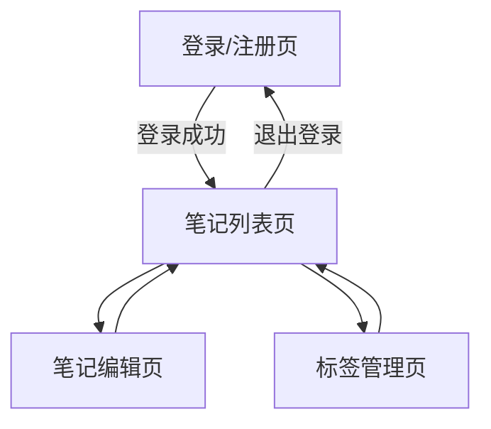

# 云笔记软件 - 产品需求文档 (PRD)

## 1. 产品概述
一款简洁高效的云笔记应用，支持多端同步、富文本编辑和标签分类管理。帮助用户随时随地记录灵感、整理知识，实现个人信息的云端存储与便捷检索。

## 2. 核心功能

### 2.1 用户角色
| 角色 | 注册方式 | 核心权限 |
|------|----------|----------|
| 普通用户 | 邮箱注册/登录 | 创建笔记、编辑笔记、管理标签、云端同步 |
| 游客用户 | 无需注册 | 仅本地体验，数据不保存 |

### 2.2 功能模块
云笔记应用包含以下核心页面：
1. **登录/注册页**：用户身份验证，支持邮箱注册和登录。
2. **笔记列表页**：展示所有笔记，支持搜索、筛选和排序。
3. **笔记编辑页**：富文本编辑器，支持创建和编辑笔记内容。
4. **标签管理页**：创建、编辑和删除标签，为笔记分类。

### 2.3 页面详情
| 页面名称 | 模块名称 | 功能描述 |
|----------|----------|----------|
| 登录/注册页 | 登录表单 | 输入邮箱和密码进行登录，支持记住登录状态。 |
| 登录/注册页 | 注册表单 | 输入邮箱、密码和确认密码完成注册，密码需满足强度要求。 |
| 登录/注册页 | 密码找回 | 通过邮箱验证重置密码。 |
| 笔记列表页 | 笔记卡片列表 | 以卡片形式展示笔记标题、摘要、标签和最后修改时间，支持列表/网格视图切换。 |
| 笔记列表页 | 搜索栏 | 实时搜索笔记标题和内容，支持关键词高亮。 |
| 笔记列表页 | 筛选器 | 按标签、创建时间、修改时间筛选笔记。 |
| 笔记列表页 | 排序选项 | 按创建时间、修改时间、标题字母顺序排序。 |
| 笔记列表页 | 新建笔记按钮 | 快速创建新笔记，跳转至编辑页。 |
| 笔记编辑页 | 富文本编辑器 | 支持标题输入、正文编辑，包含加粗、斜体、列表、链接等基础格式。 |
| 笔记编辑页 | 标签选择器 | 为当前笔记添加或移除标签，支持新建标签。 |
| 笔记编辑页 | 自动保存 | 编辑内容时自动保存到云端，显示保存状态提示。 |
| 笔记编辑页 | 删除笔记 | 删除当前笔记，需二次确认。 |
| 标签管理页 | 标签列表 | 展示所有标签，显示每个标签关联的笔记数量。 |
| 标签管理页 | 标签操作 | 创建新标签、编辑标签名称、删除标签（删除时提示关联笔记处理）。 |
| 标签管理页 | 快捷筛选 | 点击标签直接筛选对应笔记。 |

## 3. 核心流程

### 用户操作流程

**新用户注册流程**：
1. 访问应用，进入登录/注册页
2. 切换到注册表单，填写邮箱和密码
3. 系统发送验证邮件（可选）
4. 注册成功，自动登录并进入笔记列表页

**笔记创建流程**：
1. 用户在笔记列表页点击"新建笔记"按钮
2. 进入笔记编辑页，输入标题和内容
3. 为笔记添加标签（可选）
4. 系统自动保存内容
5. 用户点击返回，回到笔记列表页

**笔记管理流程**：
1. 在笔记列表页浏览所有笔记
2. 使用搜索栏查找特定笔记
3. 使用筛选器按标签或时间筛选
4. 点击笔记卡片进入编辑页查看或修改
5. 在编辑页可删除不需要的笔记

**标签管理流程**：
1. 进入标签管理页查看所有标签
2. 创建新标签用于分类
3. 编辑或删除现有标签
4. 点击标签快速筛选对应笔记

### 页面导航流程图

## 4. 用户界面设计

### 4.1 设计风格
- **主色调**：#2563EB（蓝色）作为品牌主色，#1E293B（深灰）作为文字主色
- **辅助色**：#F1F5F9（浅灰背景），#10B981（成功/保存状态），#EF4444（删除/警告）
- **按钮样式**：圆角8px，主按钮填充蓝色，次按钮描边样式
- **字体**：系统默认无衬线字体（-apple-system, BlinkMacSystemFont, 'Segoe UI'），正文14-16px，标题18-24px
- **布局风格**：左侧边栏导航 + 主内容区，卡片式内容展示
- **图标风格**：使用 Lucide 或 Heroicons 线性图标，简洁统一

### 4.2 页面设计概述
| 页面名称 | 模块名称 | UI 元素 |
|----------|----------|---------|
| 登录/注册页 | 整体布局 | 居中卡片布局，最大宽度400px，白色背景带轻微阴影，圆角12px |
| 登录/注册页 | 表单元素 | 输入框高度44px，圆角8px，聚焦时蓝色边框；按钮全宽，高度48px |
| 登录/注册页 | 切换选项 | 底部文字链接切换登录/注册模式 |
| 笔记列表页 | 侧边栏 | 固定宽度240px，包含Logo、导航菜单（全部笔记、标签管理）、用户信息 |
| 笔记列表页 | 顶部栏 | 搜索框居中，右侧显示新建笔记按钮和用户头像下拉菜单 |
| 笔记列表页 | 笔记卡片 | 白色背景，圆角12px，阴影hover效果，显示标题、摘要、标签和时间 |
| 笔记列表页 | 空状态 | 无笔记时显示插图和引导文字，提示创建第一条笔记 |
| 笔记编辑页 | 编辑器区域 | 全屏或居中最大宽度800px，标题输入框大号字体，正文区域富文本编辑器 |
| 笔记编辑页 | 工具栏 | 固定在顶部或编辑器上方，包含格式按钮、标签选择器、保存状态 |
| 笔记编辑页 | 侧边信息 | 显示创建时间、修改时间、字数统计 |
| 标签管理页 | 标签列表 | 网格布局展示标签卡片，显示标签名称和关联笔记数量 |
| 标签管理页 | 操作按钮 | 每个标签卡片上有编辑和删除图标按钮 |

### 4.3 响应式设计
- **桌面优先**：默认适配 1280px 及以上屏幕，侧边栏始终显示
- **平板适配**：768px - 1279px，侧边栏可收起为图标模式
- **移动端适配**：768px 以下，侧边栏变为底部导航或汉堡菜单，笔记列表全屏展示
- **触摸优化**：按钮和交互元素最小点击区域 44x44px，支持手势滑动操作

